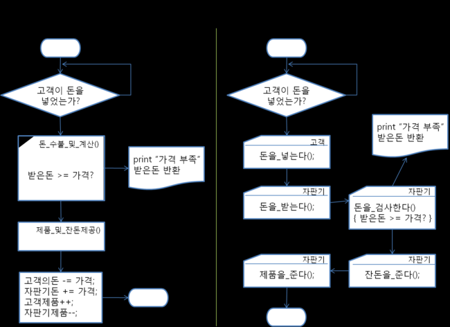

# Lee-Dong-geon
인트아이 C++, 자료구조 스터디

## [Day03](https://github.com/inti-study-cpp-ds/Lee-Dong-geon/tree/main/Day03) 클래스를 이용한 자판기 구현
* 클래스는 객체지향프로그래밍의 가장 기초가 되는 문법이다. 클래스는 객체를 구현하는 일종의 설계도라고 생각하면 되는데, 이 클래스는 접근지시자, 메서드, 필드 등을 통해 객체지향프로그래밍의 개념인 캡슐화, 정보은닉, 다형성, 상속을 구현한다.

* 과제 : 클래스를 이용해 자판기 구현
* Hint : 
 
좌측은 절차적인 방식으로 작성된 순서도이며, 우측은 객체지향적인 방식으로 작성된 순서도이다.

* 참고 : [씹어먹는 C++ - <4 - 1. 이 세상은 객체로 이루어져 있다>](https://modoocode.com/172)

## References
* [모두의 코드 - C++](https://modoocode.com/134) : C++카테고리에서 각 문법들의 사용법이나 알고리즘 등을 공부 할 수 있다.
