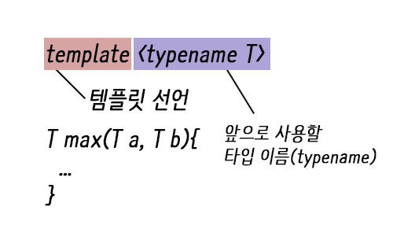

# Lee-Dong-geon
인트아이 C++, 자료구조 스터디

## [Day04](https://github.com/inti-study-cpp-ds/Lee-Dong-geon/tree/main/Day04) 템플릿
C++에서 템플릿은 두가지 용도로 쓰이는데, 기본적으로는 제네릭 프로그래밍, 그러니까 일반화 프로그래밍을 위해 도입되었다.<br>
자료구조론에서는 이 템플릿이 정말 중요한데, 그 이유는 STL(Standard Template Library) 때문으로, C++의 STL인 C++ 표준 라이브러리내의 컨테이너, 반복자, 알고리즘을 사용하기 위해 템플릿의 사용법을 알아두어야 한다.

템플릿의 또 다른 용도인 템플릿 메타 프로그래밍(TMP)은 템플릿의 인자로 자료형이 아닌 값을 직접 집어넣어 프로그래밍을 하는 것을 말하는데, 제네릭, TMP 둘 다 템플릿을 이용한다는 것은 같지만 각각 코드의 범용성 증대, 실행시간의 이득으로 서로 목표가 다르기 때문에 잘 구분해서 사용해야한다.

* [C++ Template Note - WikiDocs](https://wikidocs.net/book/54)
* [C++ 템플릿 클래스의 선언과 구현을 분리하는 방법 & 헤더 중복 포함 방지하기](https://www.sapphosound.com/archives/389)

### 1. 템플릿 함수
우리는 객체지향 언어인 C++에서 서로 다른 타입의 함수를 같은 이름으로 정의하여 유용하게 활용할 수 있는 오버로딩 이라는 개념을 배웠다.<br>
이런 유용한 기능중 하나인 오버로딩이 굉장히 비효율적으로 보이는 경우도 있다.<br>
바로 아래와 같은 경우다.<br>

```C++
int max(int a, int b){
  return (a > b ? a : b);
}

double max(double a, double b){
  return (a > b ? a : b);
}

short max(short a, short b){
  return (a > b ? a : b);
}

char max(char a, char b){
  return (a > b ? a : b);
}
```

이렇게 4가지 타입으로 같은 내용의 함수를 4번씩이나 오버로딩을 해야 한다.<br>
따라서 한번의 함수 정의로 서로 다른 자료형에 대해 유연하게 적용이 가능한 템플릿 함수가 존재한다.<br>

```C++
template <typename T>
T max(T a, T b){
  return (a > b ? a : b);
}
```
위의 오버로딩된 max 함수들을 템플릿 함수를 이용해 한번에 정의한 모습이다.<br>

<br>

#### 예시
```C++
#include<iostream>
using namespace std;

template <typename T1, typename T2>
void showdata(T1 a, T2 b){
  cout << a << " " << b << endl;
}

int main()
{
  showdata(177, 61.5);
  showdata(15, 'a');
  showdata(7.6, 15);

  return 0;
}
```
결과값 :
```50 16.5```

#### 서로 다른 자료형의 템플릿
서로 다른 자료형의 템플릿을 사용하려면 아래와 같이 코드를 작성하면 된다.
```C++
template <typename T1,typename T2>

void showData(T1 a, T2 b){
	cout<<"a : "<<a<<endl;
	cout<<"b : "<<b<<endl;
}

int main(){
	showData(10,10.5);
	return 0;
}
```

### 2. 템플릿 특수화
템플릿 특수화는 특정 매개변수의 자료형에 대해서는 다른 처리를 하고 싶을 때 사용한다.<br>
사용 방법은 아래처럼 template이 정의되어 있을 때, 같은 함수에 대해서 재정의 하고 싶은 데이터 타입을 이용해서 재정의 하면 된다.<br>
T를 없애고 넣고 싶은 데이터 타입을 넣는다.<br>

```C++
#include<iostream>
using namespace std;
template <typename T>
T max(T a, T b){
   return (a > b ? a : b);
}

template<>
double max(double a, double b)
{
   cout << a << " " << b << "중 큰수는 ? " <<endl;
   return (a > b ? a : b);
}

int main()
{
  cout << max(5, 6) << endl;
  cout << max(12.5, 16.7) << endl;

  return 0;
}
```
double 형에 대해서만 아래 특수화된 템플릿 함수가 호출되게 된다.<br>

결과값 : 
```C++
6
12.5 16.7 중 큰수는 ?
16.7
```

## References
* [모두의 코드 - C++](https://modoocode.com/134) : C++카테고리에서 각 문법들의 사용법이나 알고리즘 등을 공부 할 수 있다.
* [C++ 템플릿(Template), 템플릿 함수, 특수화](https://blog.naver.com/PostView.nhn?blogId=vjhh0712v&logNo=221553593414)
* [C++ template(템플릿)에 관하여 2 (클래스 템플릿, 템플릿 특수화)](https://blockdmask.tistory.com/45?category=249379)
